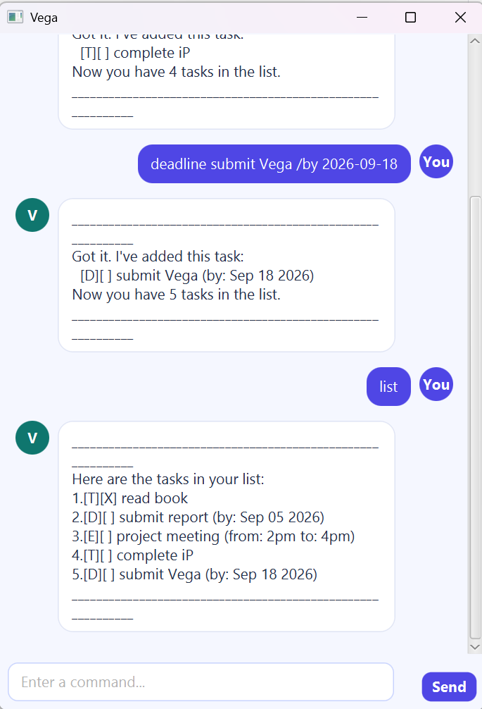

# Vega User Guide

Vega is a friendly desktop chatbot that helps you manage tasks and keep short notes through simple text commands.
Your data is saved automatically, so your tasks and notes are restored the next time you open Vega.



## Quick start

1. Install Java 25.
2. Download `vega.jar` from the latest GitHub release.
3. Open a terminal in the folder containing the JAR file.
4. Run `java -jar vega.jar`.
5. Enter a command in the box at the bottom of the window and press **Enter** or click **Send**.

> Words written in uppercase below, such as `DESCRIPTION`, represent values that you should replace.

## Command summary

| Action | Command format | Example |
|---|---|---|
| Add a todo | `todo DESCRIPTION` | `todo read a book` |
| Add a deadline | `deadline DESCRIPTION /by DATE` | `deadline submit report /by 2026-09-18` |
| Add an event | `event DESCRIPTION /from START /to END` | `event meeting /from 2pm /to 4pm` |
| List tasks | `list` | `list` |
| Mark a task | `mark NUMBER` | `mark 1` |
| Unmark a task | `unmark NUMBER` | `unmark 1` |
| Delete a task | `delete NUMBER` | `delete 1` |
| Find tasks | `find KEYWORD` | `find book` |
| Add a note | `note TEXT` | `note room code is 1234` |
| List notes | `notes` | `notes` |
| Delete a note | `delete-note NUMBER` | `delete-note 1` |
| Exit Vega | `bye` | `bye` |

## Managing tasks

### Adding a todo: `todo`

Adds a task without a date or time.

```text
todo read a book
```

Vega adds the task and displays it as `[T][ ] read a book`.

### Adding a deadline: `deadline`

Adds a task that must be completed by a date. Dates must use the `yyyy-MM-dd` format.

```text
deadline submit report /by 2026-09-18
```

Vega displays the date in a readable form, such as `(by: Sep 18 2026)`.

### Adding an event: `event`

Adds an event with a start and end description. The time values are stored as entered.

```text
event project meeting /from 2pm /to 4pm
```

### Listing tasks: `list`

Displays all tasks with one-based numbering. Use these numbers with `mark`, `unmark`, and `delete`.

```text
list
```

### Marking and unmarking tasks

Mark task 1 as completed:

```text
mark 1
```

Mark it as incomplete again:

```text
unmark 1
```

A completed task displays `[X]`; an incomplete task displays `[ ]`.

### Deleting a task: `delete`

Permanently removes the numbered task.

```text
delete 1
```

Run `list` first if you are unsure of the task number.

### Finding tasks: `find`

Displays tasks whose descriptions contain the keyword. Matching is case-insensitive.

```text
find book
```

## Managing notes

Notes are short pieces of information stored separately from tasks.

### Adding a note: `note`

```text
note room code is 1234
```

### Listing notes: `notes`

```text
notes
```

### Deleting a note: `delete-note`

Permanently removes the numbered note.

```text
delete-note 1
```

## Saving data

Vega saves changes automatically after you add, update, or delete a task or note. Task data is stored in
`data/vega.txt`, while notes are stored in `data/vega-notes.txt`. You do not need to edit these files manually.

If the files do not exist on first launch, Vega starts with empty lists and creates them when required.

## Handling errors

Invalid commands are shown in a highlighted error message. Vega also explains how to correct common problems,
such as a missing description, invalid date, missing task number, or task number that does not exist.

An invalid command does not change your saved data. Correct the command and try again.

## Exiting Vega

Enter the following command to close Vega:

```text
bye
```
